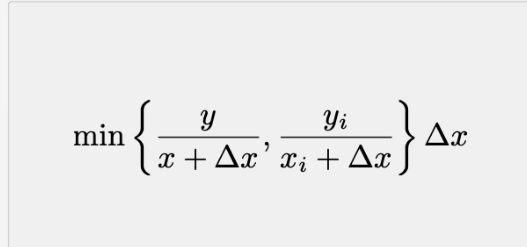

# Generalized Market Maker (GMM)

**GMM** is an interdisciplinary project through which computer scientists and economists join forces to design and build a truly global decentralized exchange (DEX) for cryptographic tokens.

Unlike traditional constant-product market makers (e.g., Uniswap V2), GMM introduces a new pricing mechanism that leverages **all available reserves blockchain-wide** to compute token prices. This results in:

- More stable prices  
- Stronger protection against price manipulation  
- Lower operational costs

---

## Key Formula

The core of GMM’s design is based on the following pricing expression:

  

This formula generalizes the price determination process by incorporating liquidity information beyond the immediate pair, enabling more robust pricing dynamics.

---

## Architecture

GMM is built on top of the **Uniswap V2** architecture, reusing its core contracts and extending them where necessary to implement the generalized pricing logic.

### GMM-Specific Additions

To enable the GMM formula, the following key modifications were introduced:

- In the `UniswapV2Pair` contract:
  - A new internal list to track addresses of **external AMMs**.
  - Functions to **add and retrieve external AMM addresses** were introduced. This allows each liquidity pair to reference other pools in the system, enabling price calculations that consider external reserves.

- In `UniswapV2Router01` and associated libraries:
  - Logic was added to **fetch external AMM data** from these references and incorporate it into the swap price calculation, as defined by the GMM formula.

These enhancements allow each pair to be aware of and interact with other pools, achieving the global perspective on liquidity that defines GMM.

---

## Resources

- [Read the whitepaper on arXiv](https://arxiv.org/abs/2503.09765)
- [Visit the GMM homepage](https://gmm.uc3m.es/)

